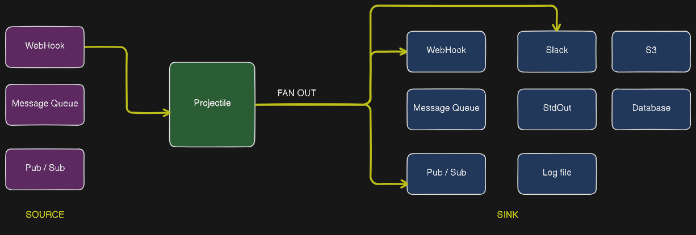

# 🚀 Projectile - Ongoing

**Projectile** is a lightweight, pluggable event router and fan-out engine.  
It connects sources (like webhooks, Kafka, or message queues) to multiple sinks (like HTTP endpoints, log files, Slack, S3, or databases), making it easy to build real-time data pipelines.

With a YAML-based config system and modular plugin support, Projectile is designed for flexibility — whether you're running it on a laptop or deploying to a cloud-native environment.





## 🎯 Key Features

- 🔁 **Source-to-Sink Routing** — One input, many outputs
- 🧩 **Pluggable Architecture** — Easy to add new sources and sinks
- 🛠️ **Optional Schema Validation & Transformation** — Hook in pre-processing logic
- ⚙️ **DSN-Based Infra Setup** — Clean separation of secrets and logic
- ⚡ **Hot-Reloadable Routes** — No restart required
- 📦 **Docker-Ready & Lightweight** — Just run and go


## 🧠 Use Cases

- Forward webhook events to Kafka, Slack, or internal APIs
- Mirror Kafka events into multiple systems
- Trigger workflows or alerts from GitHub/GitLab events
- Replace over-engineered pipelines with something lean


---

## 🧾 Example Configs

### `infra.yaml` – Secrets, DSNs, and Connection Setup

```yaml
version: v1

sources:
  gitlab-webhook:
    type: webhook
    path: /webhook/gitlab
    method: POST
    schema: schemas/gitlab.json

sinks:
  kafka-main:
    type: kafka
    dsn: kafka://broker:9092
    topic: gitlab-events

  slack-alerts:
    type: slack
    dsn: https://hooks.slack.com/services/T00000000/B00000000/XXXXXXXXXXXX

  file-logger:
    type: file
    path: ./logs/gitlab/
```


### `routes.yaml` – Routing Logic (Dev-Safe)

```yaml
version: v1

routes:
  - name: gitlab_push_pipeline
    source: gitlab-webhook
    sinks:
      - kafka-main
      - slack-alerts
      - file-logger
```


---

## 🧰 Ideal For

- Backend developers building integrations
- Internal dev tools and observability pipelines
- Event-driven architectures that need simple routing
- Teams that want flexibility without spinning up a full pub/sub system
